# ai-startup-website
This is my first repository as a DevOps engineer

## Hands-On Git Project: Collaborative Website Development With Git and GitHub

In this mini project, we'll create a step-by-step project to simulate the workflow of Tom and Jerry using Git and GitHub. This hands-on project will include installation of Git, setting up a GitHub repository, creating branches, making changes , and merging those changes back into main branch.

## Part 1: Setup and Initial Configuration
1. Install Git

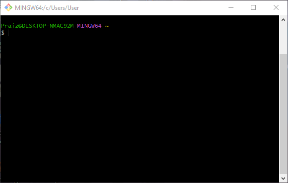

2. Create a GitHub Repository

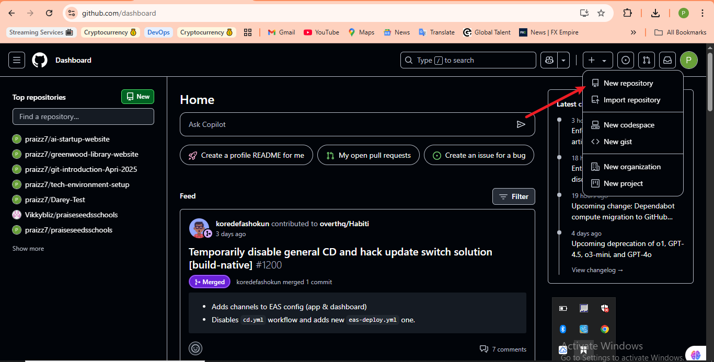
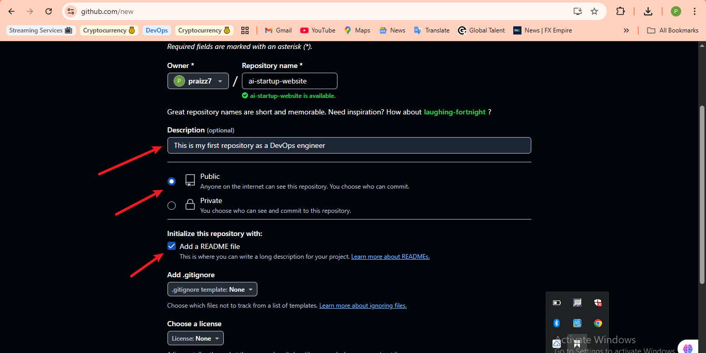

3. Clone the Repository

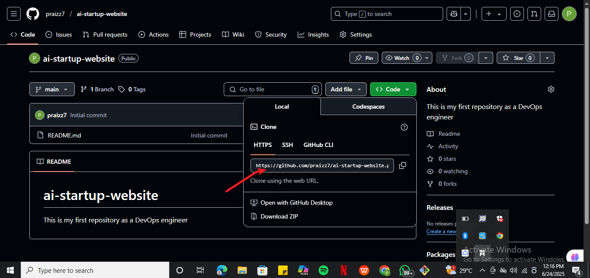

## Create Folder, Change Directory and Clone Repository

4. Navigate into repo and create index.html

- Git Status

- Git Add

- Git Status after commit and git commit

- Git Push

## Part 2: Simulating Tom and Jerry's Work
To simulate both Tom and Jerry working on the same laptop, you'll switch between two branches, making changes on each character.

1. Tom's Work
Navigate to the project directory just cloned and git branch.

- Create new branch for Tom's work

- Check branch again
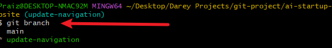
- Add content to index.html
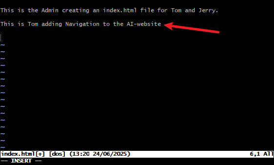
- Check if changes has been staged
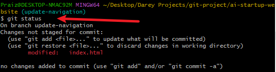
- Stage Tom's stages
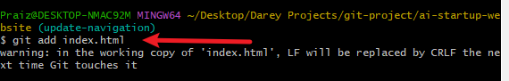
- Confirm changes have been staged for commit.
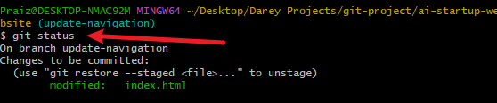
- Commit Tom's changes
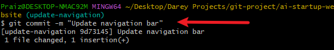
- Push Tom's changes to GitHub
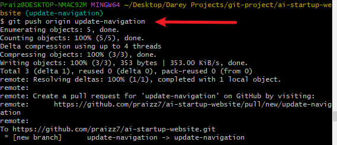

2. ## Jerry's Work
- Switch back to main branch
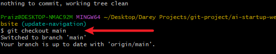
- Pull the latest changes
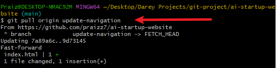
- Create a new branch for Jerry's work
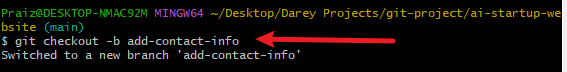
- Stage Jerry's changes
- 
Commit Jerry's Changes

- Push Jerry's branch to GitHub
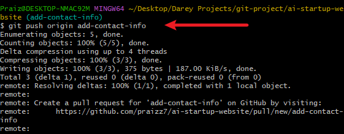

So far I have experienced collaboration between Tom and Jerry.

