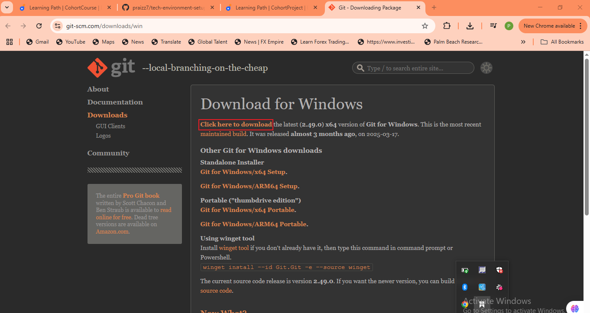

# ai-startup-website
This is my first repository as a DevOps engineer

## Hands-On Git Project: Collaborative Website Development With Git and GitHub

In this mini project, we'll create a step-by-step project to simulate the workflow of Tom and Jerry using Git and GitHub. This hands-on project will include installation of Git, setting up a GitHub repository, creating branches, making changes , and merging those changes back into main branch.

## Part 1: Setup and Initial Configuration
1. Install Git

2. Create a GitHub Repository

3. Clone the Repository

## Create Folder, Change Directory and Clone Repository

4. Navigate into repo and create index.html

- Git Status

- Git Add

- Git Status after commit and git commit

- Git Push

## Part 2: Simulating Tom and Jerry's Work
To simulate both Tom and Jerry working on the same laptop, you'll switch between two branches, making changes on each character.

1. Tom's Work
Navigate to the project directory just cloned and git branch.

- Create new branch for Tom's work

- Check branch again

- Add content to index.html

- Check if changes has been staged

- Stage Tom's stages

- Confirm changes have been staged for commit.

- Commit Tom's changes

- Push Tom's changes to GitHub

2. ## Jerry's Work
- Switch back to main branch

- Pull the latest changes

- Create a new branch for Jerry's work

- Stage Jerry's changes
- 
Commit Jerry's Changes

- Push Jerry's branch to GitHub

So far I have experienced collaboration between Tom and Jerry.

## Part 3: Merging Changes
After both Tom and Jerry pushed their changes, you (or another team member) can review and merge these changes into the main project. The process involves:
1. Creating a **Pull Request**
2. Merging the Pull Request into the main branch

**Understanding Pull Requests**:
A **Pull Request(PR)** is a feature used in GitHub(and other Git based version control systems) that allows you to notify team members about the changes you've pushed to a branch in a repository. Essentially, it's a request to review and pull in your contribution to the main project. Pull requests are central to the collaboratiove development process, enabling team members to discuss, review and make further changes before changes are merged.

**How to Create a Pull Request on GitHub**
After both Tom amnd Jerry have pushed their work to their respective branches, the next step is to create a pull request for each of them. Here's how Tom would create a pull request for his changes:
1. **Navigate to your GitHub Repository**
- Open your web browser and go to the GitHub page for the repository.
 
 2. **Switch to the Branch**:
 - Click on the branch dropdown menu near the top left corner of the file list and select the branch Tom has been working on, in this case, **update-navigation** branch
 
3. **Create New Pull Request:**
- Click the **"New pull request"** button next to the branch dropdown menu.

- GitHub will take you to a new page to initiate a pull request. It automatically selects the **main** project's branch as the base and ypur recently pushed branch as the compare branch.
4. **Review Tom's Changes:**
- Before creating the pull request, Tom would review his changes to ensure everything is correct. GitHub shows the differences between the base branch and Tom's branch. It's a good opportunity for Tom to double-check his work.
5. **Create the Pull Request:**
- If veverything looks good, click the **"Create p0ull request"** button.
- Provide a title and description for the pull request. The title should be concise and descriptive and the description should explain the change that the pull request is about, why it is needed and any other relevant details.
- After filling the information, click **"Create pull request"** again to officially open the pull request.

**Reviewing and Merging Tom's Pull Request**
Once the pull request is created, it becomes visible to other team members who can review the changes, leave comments and request additional modifications if necessary(This is an example of what collaboration is about in DevOps). When the team agrees that the changes are ready and good to go, someone with merge permissions can merge the pull request, incorporating the changes from Tom's **update-navigation** branch into the main branch.
Following the same process, jerry would create a pull request for his **ad-contact-info** branch after tom's changes have been merged, ensuring thyat the project stays up to date and conflicts are minimized.
**Updating Jerry's Branch with Latest Changes**
Before Jerry merges his changes to the main branch, it is essential to ensure his branch is up-to-date with the main branch. This is because other changes(like Tom's updates) might have been merged into the main branch after Jerry started working on his feature. Updating ensures compatibility and reduces the chances of conflicts.
 **Steps to Update Jerry's Branch**:
 - On the terminal switch to Jerry's branch:
 
 - Pull the latest changes from the main branch:
 
 Purpose: this command fetches the changes from the main branch and merges them into Jerry's **add-contact-info** branch. It ensures that any updates made to the main branch like Tom's merged changes are now included in Jerry's branch. This step is crucial for avoiding conflicts and ensuring that Jerry's work runs smoothly and integrate with the main project.
 - Merge the pull request to the main branch. Click the **"Merge pull request"** button to merge Tom's changes into the main branch. This action combines Tom's contributions with the rest of the project, completing the collaborative workflow.
 
 **Finalizing Jerry's Contribution:**
 Assuming there are no conflicts, Jerry's branch is now ready to be merged back into the main project.
 - Push the updated branch to GitHub:
 
 - Create the Pull Request(PR) for Jerry's changes, similar to how I did for Tom.
 
 - Merge Jerry's pull request. Complete the process by merging the PR into the main branch.
 

 The simulated workflow illustrates how Git facilitates collaborative development allowing multiple developers to work simultaneously on different aspects of a project and merge their contributions seamlessly, even when working on the same files.